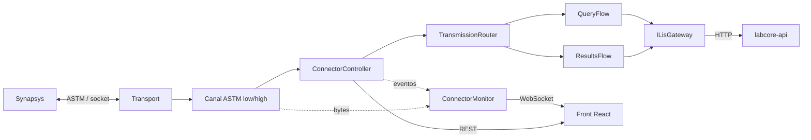
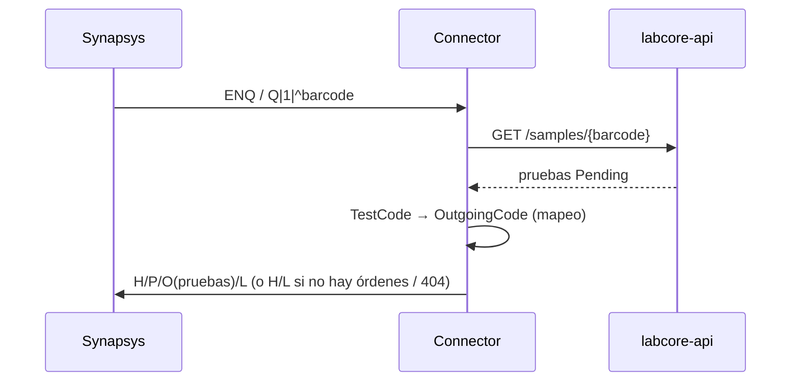
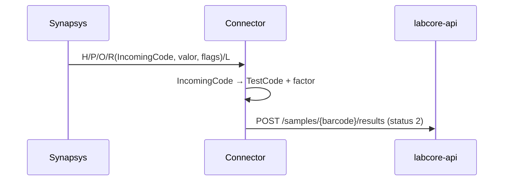

# Synapsys Connector — Arquitectura

Conector entre **Synapsys** (analizador que habla ASTM por socket) y **Labcore**
(LIS, se accede por `labcore-api` HTTP). Synapsys es **mandante**: el conector escucha y
reacciona; solo emite como respuesta a una consulta.

## Vista general

## Flujos

### Host query (Synapsys pregunta qué hacer con un tubo)

### Resultados (Synapsys envía resultados)

## Estructura y responsabilidades

| Carpeta / archivo | Responsabilidad |
| --- | --- |
| `Program.cs` | Composición de dependencias (DI), configuración web (Kestrel) y arranque del host. |
| `Runtime/ConnectorController.cs` | Ciclo de vida del puerto ASTM: abrir/cerrar/reiniciar y estado. Corre el bucle de sesiones (recibir → rutear → responder) y alimenta el monitor. |
| `Runtime/ConnectorBootstrap.cs` | Hosted service: abre el puerto al iniciar el servicio y lo cierra al apagarse. |
| `Runtime/TransportFactory.cs` | Crea un transporte nuevo (Server/Client) en cada apertura del puerto. |
| **`Monitoring/`** | Observabilidad realtime que consume el front. |
| `Monitoring/ConnectorMonitor.cs` | Bus en memoria que difunde comunicación cruda y eventos a los WebSockets suscritos. |
| `Monitoring/MonitoredConnection.cs` | Decora la conexión ASTM para publicar los bytes RX/TX al monitor. |
| **`Web/`** | Plano de control HTTP. |
| `Web/ConnectorEndpoints.cs` | REST (`/api/status`, `/api/port/*`, `/api/mappings`) y WebSockets (`/ws/comms`, `/ws/events`). |
| **`web/`** (raíz) | Front React (Vite + TS). Se compila a `wwwroot` y Kestrel lo sirve como SPA. |
| **`Transport/`** | Establecimiento del socket, independiente del protocolo. |
| `Transport/ITransport.cs` | Contrato que entrega conexiones (`IAstmConnection`) una por vez; `TcpConnection` ve el socket como flujo de bytes. |
| `Transport/SocketTransports.cs` | `SocketServerTransport` (escucha) y `SocketClientTransport` (conecta + reconecta). El modo se elige por config. |
| **`Astm/`** | Protocolo ASTM puro, sin saber de LIS ni de negocio. |
| `Astm/ControlChars.cs` | Bytes de control (ENQ/ACK/NAK/EOT/STX/ETX/…) y codec Latin1. |
| `Astm/Frame.cs` | Arma/parsea un frame low-level con checksum y numeración 0–7. |
| `Astm/AstmRecord.cs` | Un registro (H/P/O/R/Q/C/L): parseo y armado por campos/componentes. |
| `Astm/IAstmChannel.cs` | Contrato de conversación: `ReceiveAsync` / `SendAsync` en términos de registros. |
| `Astm/LowLevelChannel.cs` | ENQ/ACK/NAK/EOT + frames con checksum. Ante colisión de ENQ **cede** (Synapsys es mandante). |
| `Astm/HighLevelChannel.cs` | Transmisión completa envuelta en `VT … FS CR`, sin handshake. |
| `Astm/AstmChannelFactory.cs` | Construye el canal (low/high) según configuración y expone los separadores. |
| **`Flows/`** | Orquestación de negocio sobre los registros. |
| `Flows/TransmissionRouter.cs` | Decide el flow: hay `Q` → consulta; hay `R` → resultados. |
| `Flows/QueryFlow.cs` | Extrae el código de barras del `Q`, consulta el LIS y arma la respuesta `H/P/O/L` (o query negativa). |
| `Flows/ResultsFlow.cs` | Agrupa los `R` por tubo (según el `O` previo) y los guarda en el LIS. |
| `Flows/AstmValues.cs` | Helpers para leer identificadores y armar los registros de respuesta. |
| **`Lis/`** | Frontera con el LIS (mapeo + HTTP encapsulados). |
| `Lis/ILisGateway.cs` | Contrato en términos de dominio: `GetOrdersAsync` / `SaveResultsAsync`. Los flows no saben de HTTP ni de mapeo. |
| `Lis/LabcoreGateway.cs` | Implementación contra `labcore-api`: cachea el mapeo de códigos (`GET /instruments/{id}/tests`), aplica factor y traduce en ambos sentidos. |
| `Lis/MappingCatalog.cs` | Origen del mapeo que ve el front. Hoy mockeado (`MockMappingCatalog`); se cableará a `labcore-api`. |

## Decisiones de diseño

- **Synapsys es mandante.** El conector queda a la escucha; solo inicia un envío para
  responder una consulta y, si hay colisión de `ENQ`, cede.
- **Nivel ASTM configurable.** `LowLevel` (framing + checksum + handshake) o `HighLevel`
  (mensaje completo). El resto del código no cambia: ambos implementan `IAstmChannel`.
- **Transporte configurable.** `Server` o `Client` detrás de `ITransport`; el protocolo no
  se entera de quién abrió el socket.
- **Mapeo y consumo de API aislados.** Viven solo en `LabcoreGateway`, detrás de
  `ILisGateway`. Los flows ASTM trabajan con código de barras y códigos de instrumento.
- **Códigos de prueba mapeados en el LIS.** El mapeo `IncomingCode ↔ TestCode ↔ OutgoingCode`
  y el factor de conversión se traen de `labcore-api` y se cachean.

## Configuración (`appsettings.json`)

| Sección | Clave | Para qué |
| --- | --- | --- |
| `Transport` | `Mode` (`Server`/`Client`), `Host`, `Port`, `ReconnectSeconds` | Cómo se establece el socket. |
| `Astm` | `Level` (`LowLevel`/`HighLevel`), `UseChecksum`, `ReceiveTimeoutSeconds`, `MaxRetries`, separadores | Parámetros del protocolo. |
| `Labcore` | `BaseUrl`, `ApiKey`, `UserId`, `InstrumentId`, `MappingRefreshMinutes` | Conexión con el LIS e identidad de escritura. |

> `Labcore.InstrumentId` es obligatorio: es la clave del mapeo de códigos.

## Plano de control y front

El servicio ahora es un host web (Kestrel) además del worker ASTM: el mismo ejecutable atiende
Synapsys por socket y expone un front React para operarlo. El puerto ASTM se abre solo al iniciar
(comportamiento histórico) pero puede abrirse/cerrarse/reiniciarse en caliente desde el front.

### Endpoints

| Método | Ruta | Para qué |
| --- | --- | --- |
| GET | `/api/status` | Estado del puerto (estado, modo, remoto, contadores, último error). |
| POST | `/api/port/open` · `/close` · `/restart` | Controlan el puerto ASTM sin reiniciar el servicio. |
| GET | `/api/mappings` | Mapeo de códigos (hoy mock; luego desde `labcore-api`). |
| WS | `/ws/comms` | Comunicación ASTM cruda (RX/TX, hex + texto) en tiempo real. |
| WS | `/ws/events` | Eventos semánticos (conexión, consulta, resultados, errores). |

Ambos WebSockets envían primero un buffer reciente al conectarse y luego el stream en vivo.

### Front (`web/`)

Vite + React + TypeScript. `npm run build` compila a `src/Synapsys.Connector/wwwroot`, que Kestrel
sirve como SPA. En desarrollo, `npm run dev` (puerto 5173) hace proxy de `/api` y `/ws` al servicio
(`http://localhost:5081`). La UI muestra el panel de estado + controles, la tabla de mapeos y los
dos monitores realtime.

## Puntos abiertos

- El layout exacto de los registros `O`/`R`/`Q` sigue ASTM E1394 estándar; cuando esté la
  especificación puntual de Synapsys puede requerir ajuste fino (centralizado en
  `AstmValues.cs` y los flows).
