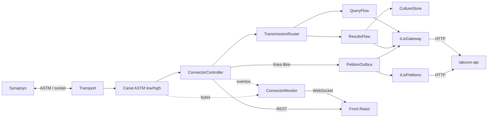
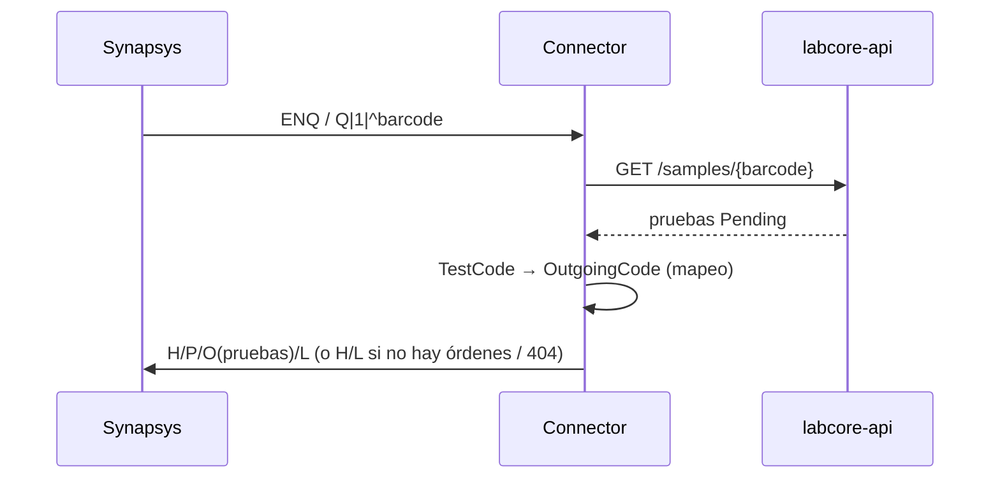
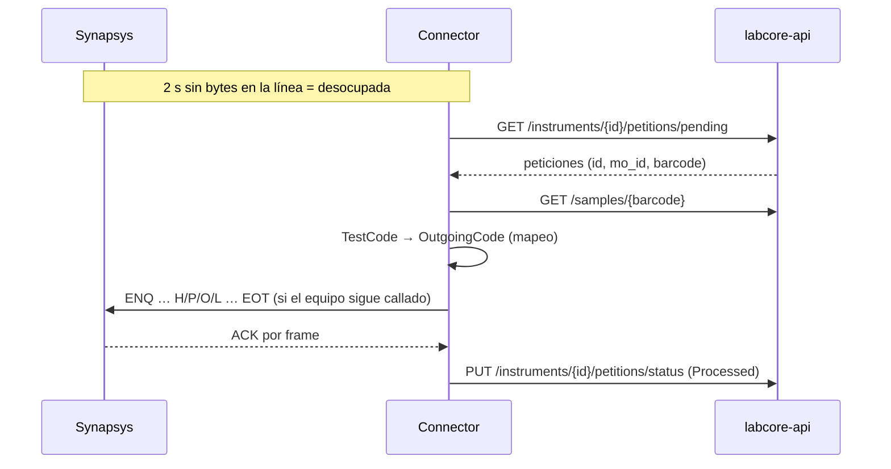
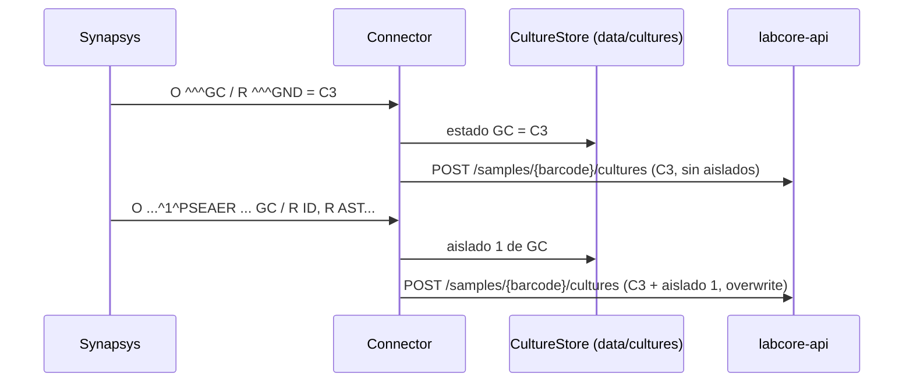

# Synapsys Connector — Arquitectura

Conector entre **Synapsys** (analizador que habla ASTM por socket) y **Labcore**
(LIS, se accede por `labcore-api` HTTP). Synapsys es **mandante**: el conector escucha y
reacciona. Por iniciativa propia solo baja las muestras que pide el LIS (peticiones), y solo con
la línea desocupada.

## Vista general



## Flujos

### Host query (Synapsys pregunta qué hacer con un tubo)



### Resultados (Synapsys envía resultados)

```mermaid
sequenceDiagram
    participant S as Synapsys
    participant C as Connector
    participant L as labcore-api
    S->>C: H/P/O(^^^RTO)/R(^^^OTHER, valor, flags)/L
    C->>C: IncomingCode del O → TestCode; valor codificado → descripción (o × factor)
    C->>L: POST /samples/{barcode}/results (status 2)
```

El `R` de Synapsys no dice qué prueba es sino de qué **categoría** es (componente 4 del campo 3).
La prueba está en el `O`:

| `O` | `R` | Qué es |
| --- | --- | --- |
| `^^^RTO` | `^^^OTHER` = `--` | Resultado simple de la prueba del `O`; el valor pasa por el mapeo de resultados. |
| `^^^GC` | `^^^GND` = `C3` | Estado del cultivo GC (positivo, negativo…). |
| `barcode^n^organismo…^^^ISOLATE RESULT…` (campo 14 = `GC`) | `^^^ID` = `^PSEAER` · `^^^AST^^ATM^,` = `^^S^^S^bnf` | Aislado *n* del cultivo GC: microorganismo y antibiograma (droga en el componente 6; interpretación = la última informada entre los componentes 3–5; CIM en 1–2). |

Un `R` de otra categoría bajo un `O` común se toma con su propio código, como cualquier equipo ASTM.

### Peticiones (el LIS pide bajar una muestra al equipo)

El LIS deja en `InstrumentPetitionQueue` una fila por muestra a enviar (`Reference` = `mo_id`,
`InstrumentExternalCode` = `a_id` del analizador). Es la misma tabla que leía el adapter de HUA;
la diferencia es que el adapter borraba la fila y el conector le cambia el estado.



- **Sin colas ni servicios aparte.** La tabla es la cola. La sesión ASTM, cuando la línea queda 2 s
  en silencio, le da el turno al `PetitionOutbox`: lee pendientes (de la más vieja a la más nueva),
  arma el mismo mensaje H/P/O/L que la respuesta a una query y lo manda. Lo leído se guarda en
  memoria solo para no consultar la tabla en cada silencio; sin pendientes, se vuelve a consultar
  cada `pollSeconds`.
- **Query o peticiones automáticas.** Son dos modos distintos y conviven: una instalación con
  host query deja el pulling apagado y Synapsys pregunta por cada tubo (la respuesta sale en el
  acto, es lo que Synapsys queda esperando); otra lo prende y el conector baja las muestras solo.
- **El equipo tiene prioridad.** Si Synapsys empieza a hablar mientras se arma el mensaje, no se
  manda: se lo atiende y se reintenta en el próximo silencio. Si contesta nuestro `ENQ` con el suyo
  (colisión), el conector cede: le responde `ACK` en el acto, recibe y procesa lo que manda
  (por ejemplo, responde su query) y recién después reintenta la petición, sin gastar un intento.
  La conexión mantiene una sola lectura en curso contra el socket (`IdleAwareConnection`), así
  saber si hay bytes no consume ninguno.
- **El estado se cambia después del envío**, cuando el equipo aceptó la transmisión completa. Un
  reinicio en el medio vuelve a mandar la muestra (llega dos veces) pero nunca la pierde. Si
  `labcore-api` no contesta al marcar, se reintenta la marca, no el envío.
- **Duplicados.** Varias pendientes de la misma muestra van en un solo envío y se marcan juntas.

| Estado | En la tabla | Cuándo |
| --- | --- | --- |
| `Pending` | `Status` y `Error` en `NULL` | La generó el LIS o se reprocesó. |
| `Processed` | `Status = 'Processed'` | Synapsys aceptó la muestra. |
| `Discarded` | `Status = 'Discarded'`, motivo en `Error` | No había nada que mandar: la muestra no existe o no tiene pruebas pendientes. |
| `Error` | `Status = 'Error'`, motivo en `Error` | El equipo la rechazó 3 veces, o 3 veces no se pudieron leer sus pruebas. No frena a las siguientes. |

Si `labcore-api` está caída no cambia nada: todo queda pendiente y se reintenta. Sin Synapsys
conectado no se consulta la tabla. Desde el front se ve cuántas hay en cada estado, la lista, y se
reprocesa cualquiera (vuelve a `Pending`).

### Cultivos (microbiología)

El LIS no tiene modelo de microbiología: el cultivo se guarda como **texto tabulado** en la prueba
del cultivo (CGR, tipo compuesto → `l_resultcomp`). Synapsys lo informa **por partes** (estado,
aislado 1, aislado 2…, en comunicaciones distintas), así que el conector acumula el cultivo y
manda siempre el informe completo.



- **El conector acumula, la API formatea.** `CultureStore` guarda por tubo, en códigos del
  instrumento, el estado de cada cultivo y sus aislados por número (un JSON por tubo en
  `data/cultures/`). El gateway traduce los códigos con los catálogos (estado con el mapeo de
  resultados, microorganismos y antibióticos con los suyos) y `labcore-api` arma el texto con el
  formato del LIS (`¬n¬` = n tabulaciones) — el mismo que armaba el adapter de Epicenter.
- **Idempotente.** Cada envío es la foto completa y reemplaza al anterior; un aislado reenviado
  reemplaza al del mismo número.
- **Si el LIS falla** el cultivo queda registrado igual, y el próximo mensaje de ese tubo manda
  el informe completo con lo que no había llegado.
- **Códigos sin catálogo** se informan tal cual (`PSEAER`) y quedan en el log, para no perder el aislado.
- **Retención.** Un tubo sin novedades en `Cultures:RetentionDays` (120) se olvida.

### Autovalidación

Los resultados simples (negativos, recuentos) se pueden guardar ya validados. La decisión es del
conector, antes de mandar el resultado: labcore-api solo recibe `status = 4` y el motivo. Hacen falta
las dos cosas: la prueba con la autovalidación habilitada en el mapeo de tests del LIS
(`autovalidationEnabled`, se edita en Mapeo de tests) y una regla que la acepte.

| Regla | Ejemplo |
| --- | --- |
| Prueba del LIS (`p_codigo`, la del mapeo de tests) | `CGR` |
| Tipo de muestra (vacío = cualquiera) | `HEMI` |
| Valor tal cual lo manda el equipo, antes del mapeo de resultados y del factor | `NEGB` |

- **Qué pasa en el LIS.** `l_estado = 4`, `l_fecha_val` y `l_usr_id_val` (el usuario del conector),
  y en `AppLog`, además de la carga, una fila "Autovalidacion: CGR en HEMI = NEGB"
  (`al_ope_id` = `Lis:Defaults:AutoValidationLogOperationId` de labcore-api).
- **Tipo de muestra.** Se pide a `GET /samples/{barcode}` una vez por tubo y solo si alguna regla que
  coincide lo exige. Si no se puede leer, esas reglas no aplican y el resultado queda cargado.
- **Cuándo no.** Apagada, prueba sin la autovalidación habilitada en el LIS, sin regla que coincida en todo, con flags del equipo, o un cultivo que ya
  tiene aislados. Esos van como siempre (`status = 2`).
- **Cultivos.** Se evalúa el estado (GND) mientras el cultivo no tenga aislados. Una vez validado,
  el LIS no deja pisarlo: si después llegan aislados de ese tubo, labcore-api los rechaza y quedan
  en el log (y en `data/cultures`). Conviene reservar las reglas de cultivo para estados finales.
- Cada autovalidación queda en el log y en el monitor de eventos (`result.autovalidated`).

## Estructura y responsabilidades

| Carpeta / archivo | Responsabilidad |
| --- | --- |
| `Program.cs` | Composición de dependencias (DI), configuración web (Kestrel) y arranque del host. |
| `Runtime/ConnectorController.cs` | Ciclo de vida del puerto ASTM: abrir/cerrar/reiniciar y estado. Corre el bucle de sesiones (recibir → rutear → responder; con la línea libre, turno de las peticiones) y alimenta el monitor. |
| `Runtime/ConnectorBootstrap.cs` | Hosted service: abre el puerto al iniciar el servicio y lo cierra al apagarse. |
| `Runtime/TransportFactory.cs` | Crea un transporte nuevo (Server/Client) en cada apertura del puerto. |
| **`Monitoring/`** | Observabilidad realtime que consume el front. |
| `Monitoring/ConnectorMonitor.cs` | Bus en memoria que difunde comunicación cruda y eventos a los WebSockets suscritos. |
| `Monitoring/MonitoredConnection.cs` | Decora la conexión ASTM para publicar los bytes RX/TX al monitor. |
| **`Web/`** | Plano de control HTTP. |
| `Web/ConnectorEndpoints.cs` | REST (`/api/status`, `/api/port/*`) y WebSockets (`/ws/comms`, `/ws/events`). |
| `Web/SettingsEndpoints.cs` | REST de settings (`/api/settings/*`): instrumento, comunicacion, peticiones, mapeo de tests y catálogos. |
| `Web/PetitionEndpoints.cs` | REST de peticiones (`/api/petitions/*`): estado del envío + resumen del LIS, listado y reproceso. |
| **`Configuration/`** | Opciones de despliegue (appsettings) y settings editables (settings/*.json). |
| `Configuration/SettingsFile.cs` | Un archivo JSON de settings: lectura al arrancar, guardado atomico y aviso de cambio. |
| `Configuration/ConnectorSettings.cs` | Modelos y validacion de `instrument.json`, `communication.json` y de los catálogos. |
| `Configuration/CodeCatalog.cs` | Catálogo código => descripción (resultados, microorganismos, antibióticos): traducción, edición e importación CSV. |
| **`web/`** (raíz) | Front React (Vite + TS). Se compila a `wwwroot` y Kestrel lo sirve como SPA. |
| **`Transport/`** | Establecimiento del socket, independiente del protocolo. |
| `Transport/ITransport.cs` | Contrato que entrega conexiones (`IAstmConnection`) una por vez; `TcpConnection` ve el socket como flujo de bytes. |
| `Transport/SocketTransports.cs` | `SocketServerTransport` (escucha) y `SocketClientTransport` (conecta + reconecta). El modo se elige por config. |
| **`Astm/`** | Protocolo ASTM puro, sin saber de LIS ni de negocio. |
| `Astm/ControlChars.cs` | Bytes de control (ENQ/ACK/NAK/EOT/STX/ETX/…) y codec Latin1. |
| `Astm/Frame.cs` | Arma/parsea un frame low-level con checksum y numeración 0–7. |
| `Astm/AstmRecord.cs` | Un registro (H/P/O/R/Q/C/L): parseo y armado por campos/componentes. |
| `Astm/IAstmChannel.cs` | Contrato de conversación: `ReceiveAsync` / `SendAsync` en términos de registros. `SendAsync` dice si se envió, si hubo colisión o si falló. |
| `Astm/IdleAwareConnection.cs` | Una sola lectura en curso contra el socket: permite esperar silencio sin consumir bytes, y los timeouts no cancelan lecturas. |
| `Astm/LowLevelChannel.cs` | ENQ/ACK/NAK/EOT + frames con checksum. Ante colisión de ENQ **cede** (Synapsys es mandante). |
| `Astm/HighLevelChannel.cs` | Transmisión completa envuelta en `VT … FS CR`, sin handshake. |
| `Astm/AstmChannelFactory.cs` | Construye el canal (low/high) según configuración y expone los separadores. |
| **`Flows/`** | Orquestación de negocio sobre los registros. |
| `Flows/TransmissionRouter.cs` | Decide el flow: hay `Q` → consulta; hay `R` → resultados. |
| `Flows/QueryFlow.cs` | Extrae el código de barras del `Q`, consulta el LIS y arma la respuesta `H/P/O/L` (o query negativa). |
| `Flows/ResultsParser.cs` | Decodifica los `O`/`R` de Synapsys por categoría: resultados simples, estado de cultivo y aislados. |
| `Flows/ResultsFlow.cs` | Guarda los resultados simples por tubo y pasa los de cultivo por el `CultureStore`. |
| **`Petitions/`** | Pulling de peticiones del LIS. |
| `Petitions/PetitionOutbox.cs` | Toma las pendientes, arma el mensaje y decide el estado según cómo terminó el envío (procesada, descartada, error o pendiente). |
| **`Microbiology/`** | Estado de los cultivos en curso. |
| `Microbiology/CultureStore.cs` | Acumula estado y aislados de cada cultivo por tubo y devuelve el informe completo de los que cambiaron. |
| `Flows/AstmValues.cs` | Helpers para leer identificadores y armar los registros de respuesta. |
| **`Lis/`** | Frontera con el LIS (mapeo + HTTP encapsulados). |
| `Lis/ILisGateway.cs` | Contrato en términos de dominio: `GetOrdersAsync` / `SaveResultsAsync` / `SaveCultureAsync`. Los flows no saben de HTTP ni de mapeo. |
| `Lis/LabcoreGateway.cs` | Implementación contra `labcore-api`: cachea el mapeo de códigos (`GET /instruments/{id}/tests`), traduce resultados codificados o aplica factor, traduce en ambos sentidos, arma el cultivo con los catálogos y aplica las reglas de autovalidación. |
| `Lis/LabcoreTestMappings.cs` | Lectura y edición del mapeo de pruebas del LIS vía `labcore-api` (`GET/POST/PUT/DELETE /instruments/{id}/tests`). Cada escritura invalida la caché del gateway. |
| `Lis/LabcorePetitions.cs` | `ILisPetitions`: la cola de peticiones del analizador vía `labcore-api` (`/instruments/{id}/petitions`: pendientes, listado, resumen, cambio de estado). |

## Decisiones de diseño

- **Synapsys es mandante.** El conector queda a la escucha; solo inicia un envío para
  responder una consulta o, con la línea desocupada, para bajar una petición del LIS. Si hay
  colisión de `ENQ`, cede: contesta `ACK` al `ENQ` de Synapsys y recibe lo suyo primero.
- **Nivel ASTM configurable.** `LowLevel` (framing + checksum + handshake) o `HighLevel`
  (mensaje completo). El resto del código no cambia: ambos implementan `IAstmChannel`.
- **Transporte configurable.** `Server` o `Client` detrás de `ITransport`; el protocolo no
  se entera de quién abrió el socket.
- **Mapeo y consumo de API aislados.** Viven solo en `LabcoreGateway`, detrás de
  `ILisGateway`. Los flows ASTM trabajan con código de barras y códigos de instrumento.
- **Códigos de prueba mapeados en el LIS.** El mapeo `IncomingCode ↔ TestCode ↔ OutgoingCode`
  y el factor de conversión se traen de `labcore-api` y se cachean.

## Configuración

Se separa lo que es **de despliegue** (lo toca quien instala) de lo que es **operativo**
(se edita desde el front). Cada archivo operativo es un tema con su propio ciclo de vida.

| Archivo | Contenido | Quién lo edita | Cuándo aplica |
| --- | --- | --- | --- |
| `appsettings.json` | `Urls`, `Labcore` (`BaseUrl`, `ApiKey`, `UserId`, `MappingRefreshMinutes`, `OverwriteResults`), `Cultures` (`Directory`, `RetentionDays`), `Settings:Directory`, `Logging` | Instalador | Al reiniciar el servicio |
| `settings/instrument.json` | `instrumentId` (Analizadores.a_id) | Front › Instrumento | En el acto (invalida la caché de mapeo) |
| `settings/communication.json` | `transport` (`mode`, `host`, `port`, `reconnectSeconds`) y `astm` (`level`, checksum, timeouts, separadores) | Front › Comunicación | Al guardar se reinicia el puerto si estaba abierto |
| `settings/petitions.json` | `enabled` (apagado por defecto), `pollSeconds` (10) | Front › Peticiones | En el acto |
| `settings/autovalidation.json` | `enabled` (apagado por defecto), `rules: [{ testCode, sampleType, result }]` | Front › Autovalidacion | En el acto |
| `settings/result-mappings.json` | `mappings: [{ code, description }]` | Front › Mapeo de resultados (alta, edición, baja, borrar todo, CSV) | En el acto |
| `settings/organisms.json` · `antibiotics.json` | `mappings: [{ code, description }]` | Front › Microbiología (igual que el mapeo de resultados) | En el acto |
| *(LIS)* `AnalizadoresDet` | Mapeo de pruebas: entrante/saliente, prueba del LIS, factor, sufijo… | Front › Mapeo de tests, vía `labcore-api` | En el acto (invalida la caché de mapeo) |

- `settings/` vive junto a `appsettings.json` (o donde diga `Settings:Directory`). Está fuera de
  git y del publish: es de cada instalación, un redeploy no la pisa.
- Si un archivo no existe se crea al arrancar. `instrument.json` y `communication.json` toman el
  valor inicial de las secciones viejas `Labcore:InstrumentId`, `Transport` y `Astm` si todavía
  están en `appsettings.json` (migración sin pasos manuales); `result-mappings.json` arranca con el
  mapeo del adapter de Epicenter (`Configuration/Defaults/result-mappings.json`).
- El guardado es atómico (temporal + reemplazo): un corte a mitad no deja un JSON roto.
- `instrumentId` es obligatorio: sin él no se consulta el mapeo ni se cargan resultados.

## Plano de control y front

El servicio ahora es un host web (Kestrel) además del worker ASTM: el mismo ejecutable atiende
Synapsys por socket y expone un front React para operarlo. El puerto ASTM se abre solo al iniciar
(comportamiento histórico) pero puede abrirse/cerrarse/reiniciarse en caliente desde el front.

### Endpoints

| Método | Ruta | Para qué |
| --- | --- | --- |
| GET | `/api/status` | Estado del puerto (estado, modo, remoto, contadores, último error). |
| POST | `/api/port/open` · `/close` · `/restart` | Controlan el puerto ASTM sin reiniciar el servicio. |
| GET · PUT | `/api/settings/instrument` | Instrumento configurado. |
| GET · PUT | `/api/settings/communication` | Transporte + ASTM. El PUT reinicia el puerto si estaba abierto. |
| GET · PUT | `/api/settings/petitions` | Prender/apagar el pulling de peticiones y su intervalo. |
| GET | `/api/petitions/status` | Estado del envío (último poll, último envío, enviadas, último error), si hay Synapsys conectado y cuántas peticiones hay en cada estado en el LIS. |
| GET | `/api/petitions?status=&barcode=&beforeId=&top=` | Listado de peticiones, de la más nueva a la más vieja. |
| POST | `/api/petitions/reprocess` | `{ ids }`: las vuelve a pendientes; se mandan en el próximo silencio. |
| GET · POST · PUT · DELETE | `/api/settings/test-mappings` | Mapeo de pruebas del LIS (PUT/DELETE con `?incomingCode=`). |
| GET · PUT · DELETE | `/api/settings/catalogs/{catalog}` | Catálogo `results`, `organisms` o `antibiotics` (PUT/DELETE con `?code=`; PUT sin `code` = alta). |
| POST | `/api/settings/catalogs/{catalog}/clear` · `/import?replace=` | Borrar todos · importar CSV (`codigo;descripcion`). |
| WS | `/ws/comms` | Comunicación ASTM cruda (RX/TX, hex + texto) en tiempo real. |
| WS | `/ws/events` | Eventos semánticos (conexión, consulta, resultados, errores). |

Ambos WebSockets envían primero un buffer reciente al conectarse y luego el stream en vivo.

### Front (`web/`)

Vite + React + TypeScript. `npm run build` compila a `src/Synapsys.Connector/wwwroot`, que Kestrel
sirve como SPA. En desarrollo, `npm run dev` (puerto 5173) hace proxy de `/api` y `/ws` al servicio
(`http://localhost:5081`). La UI tiene estas secciones: estado + controles del puerto, los dos monitores
realtime, Peticiones (prender/apagar, contadores, lista y reproceso), Settings (instrumento, comunicación, mapeo de tests y mapeo de resultados) y Microbiología
(microorganismos y antibióticos).

## Puntos abiertos

- **La tabla de peticiones crece.** El adapter de HUA borraba cada fila; el conector la deja con su
  estado para poder verla y reprocesarla. Hace falta una purga periódica de `Processed`/`Discarded`
  viejas (job del LIS o un endpoint), y conviene un índice por `InstrumentExternalCode, Status, Error`.
- **Largos de `Status` y `Error`.** No hay esquema de la tabla a mano: la API escribe `Status` de hasta
  9 caracteres y corta `Error` en 250. Si una instalación tiene columnas más chicas, se ajusta con
  un override de `Petitions/UpdatePetitionStatus`.

- **Mecanismos de resistencia**: el modelo y el informe los soportan, pero falta un log real para
  saber cómo los manda Synapsys. Hoy una categoría desconocida dentro de un aislado queda en el log
  y se ignora.

- El layout exacto de los registros `O`/`R`/`Q` sigue ASTM E1394 estándar; cuando esté la
  especificación puntual de Synapsys puede requerir ajuste fino (centralizado en
  `AstmValues.cs` y los flows).
