# Synapsys Connector — Guía de implementación y uso

Conector entre el analizador **BD Synapsys** y el LIS **Labcore**. Esta guía cubre lo necesario para
instalarlo, configurarlo y operarlo en el día a día.

**Contenido**

1. [Qué hace el conector](#1-qué-hace-el-conector)
2. [Arquitectura](#2-arquitectura)
3. [Requisitos](#3-requisitos)
4. [Instalación](#4-instalación)
5. [Licencia](#5-licencia)
6. [Configuración](#6-configuración)
7. [Monitoreo](#7-monitoreo)
8. [Checklist de puesta en marcha](#8-checklist-de-puesta-en-marcha)
9. [Solución de problemas](#9-solución-de-problemas)
10. [Anexo: API y eventos](#10-anexo-api-y-eventos)

---

## 1. Qué hace el conector

| Función | Descripción |
| --- | --- |
| **Host query** | Synapsys pregunta por un tubo (código de barras) y el conector responde con las pruebas pendientes que tiene esa muestra en el LIS. |
| **Peticiones** (opcional) | El LIS deja muestras en su cola de peticiones y el conector se las envía al equipo por iniciativa propia, cuando la línea está libre. |
| **Resultados** | Recibe los resultados, traduce los códigos del equipo a los del LIS y los guarda en Labcore. |
| **Microbiología** | Arma el informe completo de cada cultivo (estado, aislados y antibiograma), que Synapsys envía por partes. |
| **Autovalidación** (opcional) | Guarda como validados los resultados simples que cumplen reglas definidas por el laboratorio (por ejemplo, urocultivos negativos). |
| **Panel web** | Estado del puerto, monitor de la comunicación en tiempo real, peticiones, configuración y licencia. |

---

## 2. Arquitectura

### 2.1 Vista general

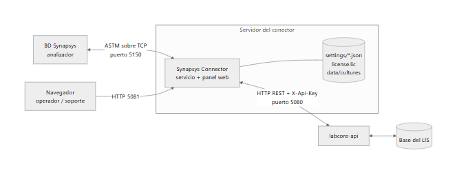

El conector es **un único servicio** que corre en un servidor Windows del laboratorio y cumple tres roles:

- **Interfaz con el equipo:** habla ASTM (E1381 de bajo nivel / E1394 de mensajes) con Synapsys sobre TCP/IP.
- **Cliente del LIS:** no accede a la base de datos. Todo lo hace a través de **labcore-api** (HTTP REST),
  autenticado con una API key.
- **Panel web:** el mismo proceso sirve el panel de operación y su API (por defecto en el puerto 5081).

### 2.2 Componentes

| Componente | Responsabilidad |
| --- | --- |
| **Transporte** | Establece el socket TCP con Synapsys, como *Server* (escucha) o como *Client* (se conecta al equipo), y reconecta solo si se cae. |
| **Canal ASTM** | Implementa el protocolo: `ENQ/ACK/NAK/EOT`, frames numerados con checksum y reintentos. Soporta *LowLevel* (E1381) y *HighLevel*. |
| **Flujos** | Deciden qué hacer con cada transmisión: responder una consulta, procesar resultados o acumular un cultivo. |
| **Cola de peticiones** | Con la línea en silencio (2 s sin tráfico), toma las peticiones pendientes del LIS y las envía al equipo. |
| **Gateway del LIS** | Traduce códigos (mapeo de pruebas, de resultados y catálogos de microbiología), aplica factores y reglas de autovalidación, y llama a labcore-api. |
| **Monitor** | Publica en tiempo real la comunicación cruda y los eventos al panel web. |
| **Licenciamiento** | Verifica la licencia firmada; sin licencia vigente no se abre el puerto ASTM. |

### 2.3 Flujos principales

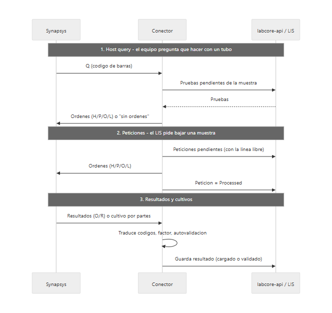

- **Synapsys es el mandante.** El conector escucha y responde. Solo inicia una transmisión para enviar
  una petición, y solo con la línea libre. Si el equipo empieza a hablar al mismo tiempo, el conector
  le cede el turno y reintenta después.
- **Peticiones sin pérdidas.** Una petición se marca como `Processed` recién cuando el equipo aceptó la
  transmisión completa. Si hay un corte a mitad, la muestra se vuelve a enviar; nunca se pierde.
- **Cultivos acumulados.** Synapsys informa estado, aislado 1, aislado 2… en mensajes distintos. El conector
  guarda lo recibido por tubo (`data/cultures/`) y cada vez envía al LIS el informe completo, que reemplaza
  al anterior.
- **Tolerancia a caídas del LIS.** Si labcore-api no responde, las peticiones quedan pendientes y se
  reintentan. Los cultivos quedan registrados en disco y se completan con el próximo mensaje de ese tubo.

### 2.4 Qué se guarda y dónde

| Ubicación | Contenido | Quién lo edita |
| --- | --- | --- |
| `appsettings.json` | Puerto del panel, conexión a labcore-api, usuario del LIS, logging | Instalador (requiere reiniciar el servicio) |
| `settings/*.json` | Instrumento, comunicación, peticiones, autovalidación, mapeo de resultados, microorganismos, antibióticos | Panel web (aplica en el acto) |
| **LIS** (`AnalizadoresDet`) | Mapeo de pruebas del analizador | Panel web, vía labcore-api |
| **LIS** (`InstrumentPetitionQueue`) | Cola de peticiones y su estado | LIS / panel web (reproceso) |
| `license.lic` | Licencia instalada | Panel web |
| `data/cultures/` | Cultivos en curso (un JSON por tubo, se purgan a los 120 días sin novedades) | El conector |

> La carpeta `settings/` es propia de cada instalación: una actualización del conector no la pisa.
> Conviene incluirla en el respaldo del servidor junto con `license.lic` y `appsettings.json`.

---

## 3. Requisitos

| Ítem | Detalle |
| --- | --- |
| Servidor | Windows 10/11 o Windows Server, con acceso de red al analizador y a labcore-api. |
| Runtime | ASP.NET Core Runtime **10** (x64). |
| labcore-api | Accesible desde el servidor, con una **API key** para el conector. |
| LIS | El analizador dado de alta en `Analizadores` (se necesita su `a_id`) y un usuario del LIS para registrar los resultados (`usr_id`). |
| Red | Puerto TCP para ASTM (por defecto **5150**) abierto entre Synapsys y el servidor. Puerto del panel (por defecto **5081**). |
| Navegador | Chrome o Edge actualizados para el panel. |

---

## 4. Instalación

1. Copiar la carpeta del conector al servidor, por ejemplo `C:\Arenco\SynapsysConnector\`.
2. Editar `appsettings.json` (ver [6.1](#61-appsettingsjson-despliegue)).
3. Ejecutar `Synapsys.Connector.exe` y abrir el panel en `http://localhost:5081`.
4. Instalar la licencia (ver [5](#5-licencia)). Hasta que no haya licencia, el panel funciona pero el
   puerto ASTM queda cerrado.
5. Completar la configuración desde el panel ([6.2](#62-instrumento) en adelante).
6. Registrarlo como servicio de Windows con inicio automático, para que arranque con el servidor.

Al primer inicio el conector crea `settings/` con los valores por defecto. El mapeo de resultados arranca
precargado con la tabla estándar de Synapsys.

---

## 5. Licencia

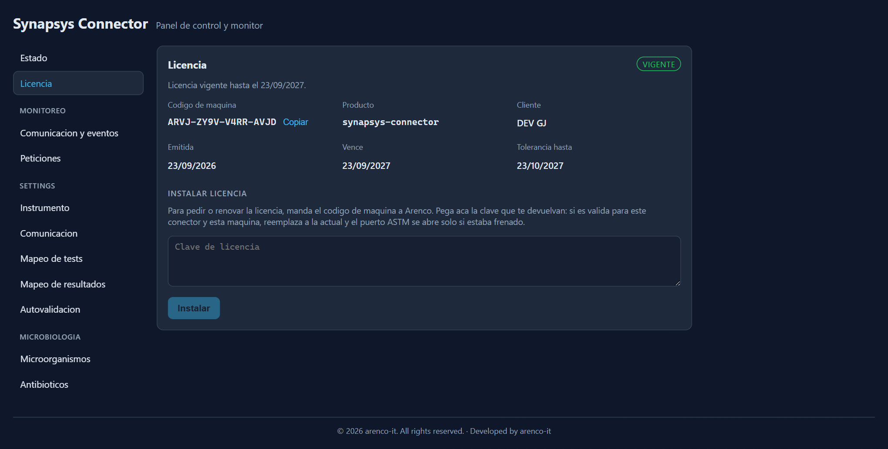

*Pantalla Licencia (ejemplo con una licencia de desarrollo).*

1. En **Licencia**, copiar el **código de máquina** (`XXXX-XXXX-XXXX-XXXX`) y enviarlo a Arenco.
2. Arenco devuelve una clave de licencia. Pegarla en **Instalar licencia** → **Instalar**.
3. Si la clave es válida para este conector y esta máquina, reemplaza a la actual y el puerto ASTM se
   abre solo.

| Estado | ¿Funciona? | Cuándo |
| --- | --- | --- |
| Vigente | Sí | Faltan 30 días o más para el vencimiento. |
| Por vencer | Sí, con aviso | Faltan menos de 30 días. El panel muestra un banner. |
| En tolerancia | Sí, con aviso | Venció hace 30 días o menos. |
| Vencida / inválida / de otra máquina | **No** | El puerto ASTM se cierra. El panel sigue disponible para instalar una nueva clave. |

> El código de máquina está atado a la instalación de Windows. Si se reinstala el sistema operativo o se
> mueve el conector a otro servidor, hay que pedir una licencia nueva.

---

## 6. Configuración

### 6.1 `appsettings.json` (despliegue)

```json
{
  "Urls": "http://localhost:5081",
  "Labcore": {
    "BaseUrl": "http://servidor-lis:5080/api/v1",
    "ApiKey": "<api-key-del-conector>",
    "UserId": 25,
    "MappingRefreshMinutes": 30,
    "OverwriteResults": true
  },
  "Cultures": { "Directory": "data/cultures", "RetentionDays": 120 },
  "Logging": { "LogLevel": { "Default": "Information" } }
}
```

| Clave | Descripción |
| --- | --- |
| `Urls` | Dónde escucha el panel. Con `localhost` solo se accede desde el propio servidor; para abrirlo desde otra PC usar `http://0.0.0.0:5081`. |
| `Labcore:BaseUrl` | URL de labcore-api, incluida la versión (`/api/v1`). |
| `Labcore:ApiKey` | API key que asigna Labcore al conector. |
| `Labcore:UserId` | Usuario del LIS (`AppUsers.usr_id`) con el que se cargan y validan los resultados. |
| `Labcore:MappingRefreshMinutes` | Cada cuánto se relee el mapeo de pruebas del LIS. |
| `Labcore:OverwriteResults` | `true`: si el equipo reenvía un resultado no validado, se reemplaza. |
| `Cultures:RetentionDays` | Días sin novedades tras los cuales se descarta un cultivo en curso. |

> **Seguridad:** el panel no tiene login. Si se publica fuera de `localhost`, restringir el acceso al
> puerto con el firewall de Windows a las PCs de soporte.

Los cambios en este archivo requieren reiniciar el servicio.

### 6.2 Instrumento

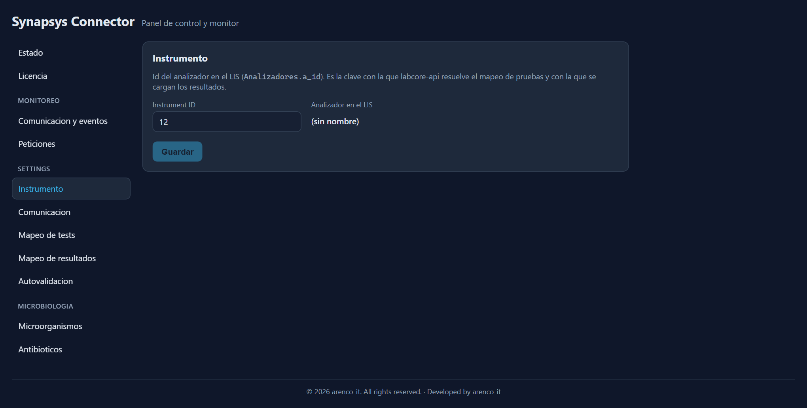

**Instrument ID** es el `a_id` del analizador en la tabla `Analizadores` del LIS. Es obligatorio: sin él
no se lee el mapeo de pruebas ni se cargan resultados.

### 6.3 Comunicación

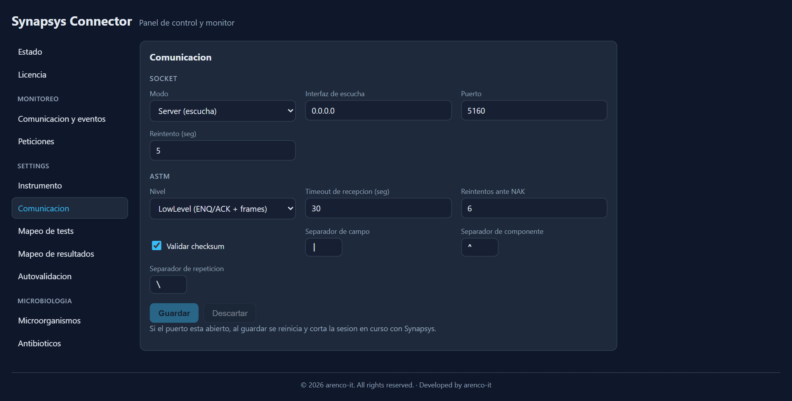

Configuración típica, con Synapsys conectándose al servidor:

```json
{
  "transport": { "mode": "Server", "host": "0.0.0.0", "port": 5150, "reconnectSeconds": 5 },
  "astm": {
    "level": "LowLevel", "useChecksum": true, "receiveTimeoutSeconds": 30, "maxRetries": 6,
    "fieldSeparator": "|", "componentSeparator": "^", "repeatSeparator": "\\"
  }
}
```

| Campo | Valores |
| --- | --- |
| Modo | **Server**: el conector escucha y Synapsys se conecta a la IP del servidor. **Client**: el conector se conecta a la IP del equipo (en *Host* va la IP de Synapsys). |
| Puerto | Debe coincidir con el configurado en el LIS Interface de Synapsys. |
| Nivel ASTM | **LowLevel** (ENQ/ACK + frames con checksum) — el habitual para Synapsys. |
| Timeout / reintentos | Espera máxima por un ACK o frame, y reintentos ante NAK. |

> Al guardar, si el puerto estaba abierto, se reinicia y se corta la sesión en curso con el equipo.
> Conviene hacerlo con el equipo sin transmitir.

### 6.4 Mapeo de tests

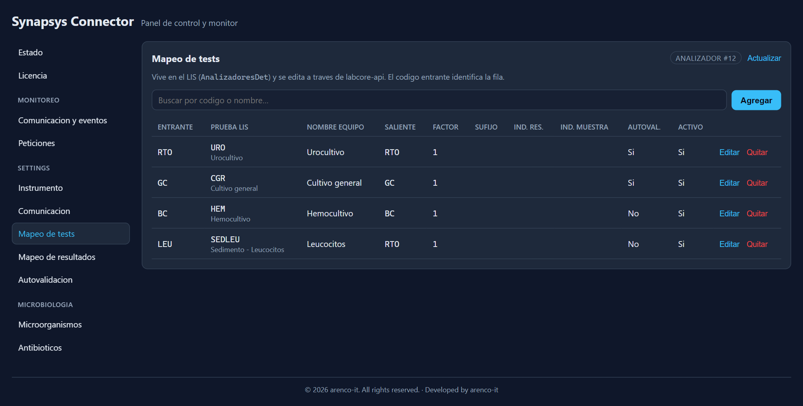

Relaciona los códigos del equipo con las pruebas del LIS. Se guarda en el LIS (`AnalizadoresDet`), así que
se puede editar desde este panel o directamente en Labcore (usar **Actualizar** para ver los cambios
hechos en el LIS).

| Columna | Uso | Ejemplo |
| --- | --- | --- |
| Entrante | Código con el que Synapsys informa la prueba (en el registro `O`). | `RTO`, `GC` |
| Prueba LIS | Código de la prueba en Labcore (`p_codigo`). | `URO`, `CGR` |
| Saliente | Código que se envía al equipo al bajar la orden. | `RTO` |
| Factor | Multiplicador para resultados numéricos (1 = sin conversión). | `1` |
| Autoval. | Habilita la autovalidación para esa prueba (ver [6.7](#67-autovalidación)). | Sí / No |
| Activo | Las filas inactivas se ignoran. | Sí |

### 6.5 Mapeo de resultados

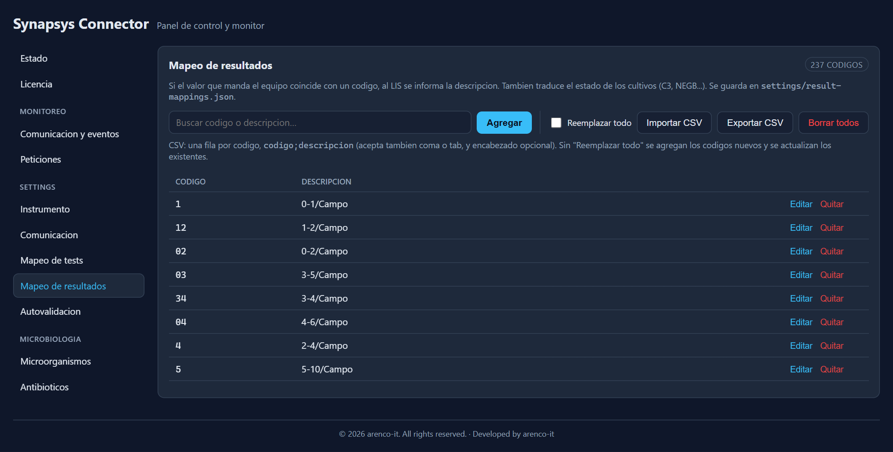

Traduce los valores codificados que envía el equipo al texto que se informa en el LIS. También traduce el
estado de los cultivos. Si el valor no está en la tabla, se informa tal cual.

| Código del equipo | Se informa en el LIS |
| --- | --- |
| `NEGB` | NO SE OBTUVO DESARROLLO BACTERIANO |
| `C3` | Positivo (Bacilos Gram Negativos) |
| `G8` | Cocos Gram positivos |

**Carga masiva:** **Importar CSV** acepta una fila por código, `codigo;descripcion` (también coma o
tabulación, con encabezado opcional):

```csv
codigo;descripcion
NEGB;NO SE OBTUVO DESARROLLO BACTERIANO
C3;Positivo (Bacilos Gram Negativos)
```

Sin **Reemplazar todo**, agrega los códigos nuevos y actualiza los existentes. Con **Reemplazar todo**,
el archivo sustituye a la tabla completa. **Exportar CSV** descarga la tabla actual (útil como respaldo).

### 6.6 Microbiología: microorganismos y antibióticos

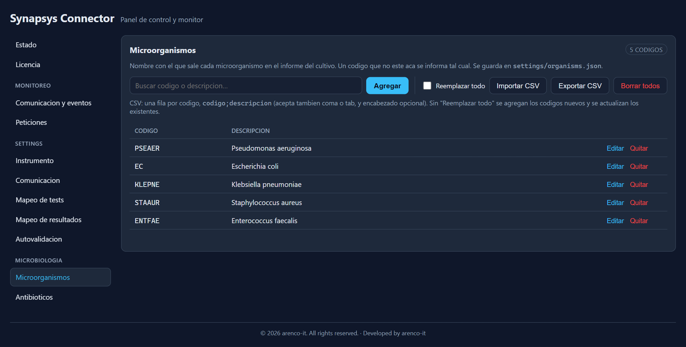

Dos catálogos con el mismo manejo que el mapeo de resultados (alta, edición, CSV). Definen el nombre con
el que aparece cada microorganismo y cada antibiótico en el informe del cultivo.

| Catálogo | Código Synapsys | Nombre en el informe |
| --- | --- | --- |
| Microorganismos | `PSEAER` | Pseudomonas aeruginosa |
| Antibióticos | `CAZ` | Ceftazidima |

Un código sin traducción se informa tal cual (por ejemplo, `PSEAER`) y queda registrado en el log, para
completarlo en el catálogo.

### 6.7 Autovalidación

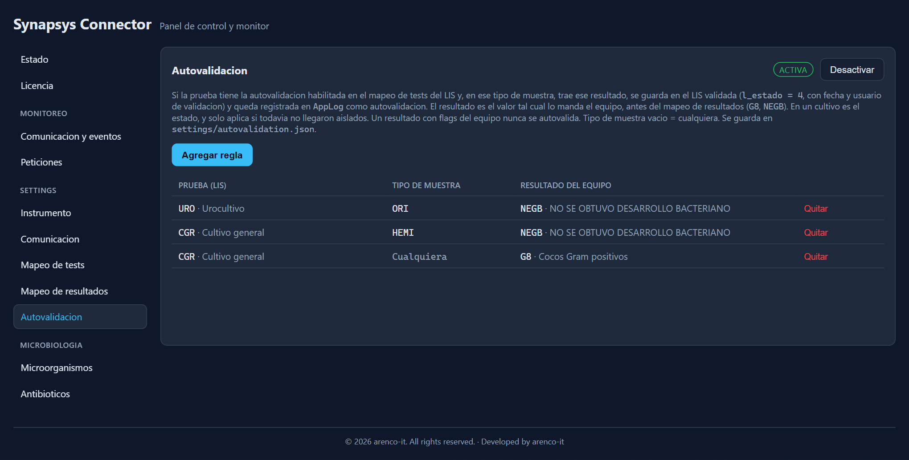

Un resultado se guarda **validado** solo si se cumplen todas estas condiciones:

1. La autovalidación está **activa** en esta pantalla.
2. La prueba tiene **Autoval. = Sí** en el mapeo de tests.
3. Hay una regla que coincide en **prueba del LIS**, **tipo de muestra** (vacío = cualquiera) y
   **resultado del equipo** (el código original, antes de traducirlo).
4. El equipo no informó *flags* para ese resultado.
5. En cultivos: todavía no llegaron aislados.

Ejemplo de reglas (`settings/autovalidation.json`):

```json
{
  "enabled": true,
  "rules": [
    { "testCode": "URO", "sampleType": "ORI",  "result": "NEGB" },
    { "testCode": "CGR", "sampleType": "HEMI", "result": "NEGB" }
  ]
}
```

En el LIS el resultado queda con `l_estado = 4`, fecha y usuario de validación, y una entrada en la
bitácora (`AppLog`) del tipo *"Autovalidacion: URO en ORI = NEGB"*.

> Una vez validado un cultivo, el LIS no permite modificarlo. Por eso conviene definir reglas de cultivo
> solo para estados finales (por ejemplo, negativos).

### 6.8 Peticiones

Se activa desde **Monitoreo › Peticiones** (botón **Activar/Desactivar**) y se define cada cuántos
segundos se consulta la cola del LIS cuando no hay nada pendiente (por defecto, 10).

| Modo | Cuándo usarlo |
| --- | --- |
| **Host query** (peticiones desactivadas) | Synapsys pregunta por cada tubo al cargarlo. Es el modo por defecto. |
| **Peticiones activadas** | El LIS decide qué muestras bajar al equipo, sin esperar la consulta. Ambos modos pueden convivir. |

---

## 7. Monitoreo

### 7.1 Estado del puerto

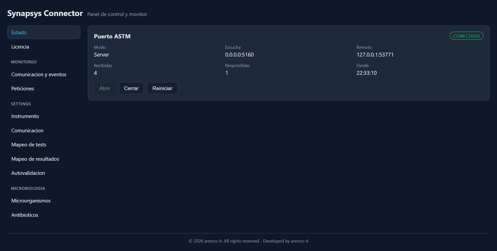

| Estado | Significado |
| --- | --- |
| **Conectado** | Synapsys está conectado (se ve su IP en *Remoto*). |
| **Escuchando** | Puerto abierto, esperando la conexión del equipo. |
| **Cerrado** | Puerto cerrado manualmente o bloqueado por la licencia. |
| **Error** | Falla del puerto; el detalle se muestra en la tarjeta. |

*Recibidas* y *Respondidas* cuentan transmisiones desde el último arranque. **Abrir / Cerrar /
Reiniciar** actúan sobre el puerto ASTM sin reiniciar el servicio.

### 7.2 Comunicación y eventos (tiempo real)

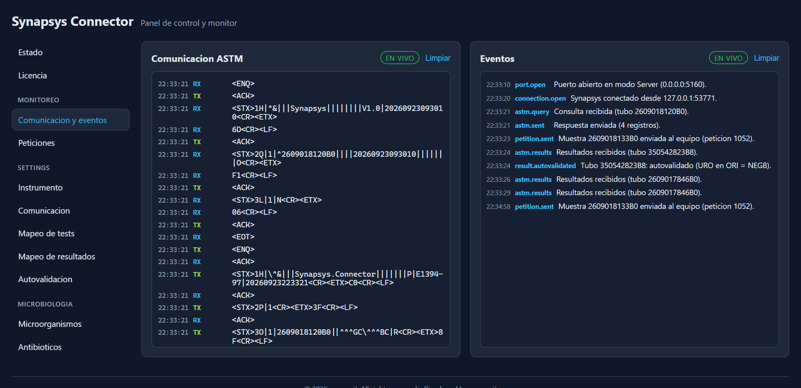

- **Comunicación ASTM** (izquierda): el tráfico crudo, byte a byte. `RX` = recibido del equipo,
  `TX` = enviado por el conector. Los caracteres de control se muestran como `<ENQ>`, `<ACK>`, `<STX>`, etc.
- **Eventos** (derecha): lo que el conector hizo con ese tráfico, en lenguaje de negocio.

Lectura de la captura:

| Hora | Evento | Qué pasó |
| --- | --- | --- |
| 22:33:21 | `astm.query` → `astm.sent` | Synapsys consultó el tubo 2609018120B0 y se le respondió con sus órdenes. |
| 22:33:23 | `petition.sent` | Con la línea libre, se envió la petición 1052 del LIS. |
| 22:33:24 | `astm.results` → `result.autovalidated` | Llegó un urocultivo negativo y se guardó validado por la regla `URO en ORI = NEGB`. |
| 22:33:26 / 29 | `astm.results` | Llegaron el estado y el aislado 1 de un cultivo; se actualizó el informe en el LIS. |

Los eventos en rojo o amarillo (`connection.error`, `petition.error`, `petition.discarded`,
`license.warning`, etc.) son los que requieren atención. Ver el listado completo en el [anexo](#10-anexo-api-y-eventos).

> Al abrir el monitor se muestra el tráfico reciente y después sigue en vivo. **Limpiar** solo borra la
> vista, no afecta la comunicación.

### 7.3 Peticiones

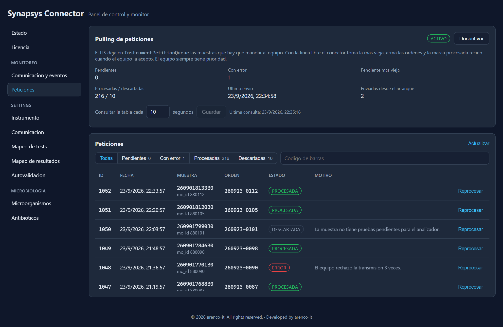

Muestra el resumen de la cola del LIS y el detalle de cada petición.

| Estado | Significado | Acción |
| --- | --- | --- |
| **Pendiente** | Esperando la línea libre. | — |
| **Procesada** | Synapsys aceptó la muestra. | — |
| **Descartada** | No había nada para enviar (la muestra no existe o no tiene pruebas pendientes para el analizador). | Revisar la orden en el LIS y **Reprocesar** si corresponde. |
| **Error** | El equipo la rechazó 3 veces, o no se pudieron leer sus pruebas. No frena a las siguientes. | Revisar el monitor / log y **Reprocesar**. |

**Reprocesar** devuelve la petición a *Pendiente* y se envía en el próximo silencio de la línea.

> Un aumento sostenido de *Pendientes* con *Pendiente más vieja* alejándose indica que el equipo no está
> conectado o que la línea no queda libre.

### 7.4 Logs

El conector escribe su log en la salida estándar del servicio. Nivel por defecto `Information`; para un
diagnóstico puntual se puede subir a `Debug` en `appsettings.json` (`Logging:LogLevel:Default`) y
reiniciar. Mensajes útiles:

- `Sin mapeo para el codigo de instrumento X` → falta la fila en el mapeo de tests.
- `El microorganismo/antibiotico X no esta en el catalogo` → completar el catálogo de microbiología.
- `labcore-api rechazo los resultados del tubo X (...)` → el LIS rechazó la carga; el motivo va en el mensaje.

### 7.5 Monitoreo externo

Para integrarlo con una herramienta de monitoreo (Zabbix, PRTG, etc.), consultar periódicamente:

```http
GET http://<servidor>:5081/api/status
```

```json
{
  "state": "Connected",
  "mode": "Server",
  "port": 5150,
  "remote": "10.0.5.21:53771",
  "transmissionsReceived": 4,
  "responsesSent": 1,
  "lastError": null,
  "blockedByLicense": false
}
```

Alertar si `state` no es `Connected` durante un período prolongado, si `blockedByLicense` es `true` o si
`lastError` tiene valor. Para la licencia, `GET /api/license` devuelve `daysRemaining` y `needsAttention`.

---

## 8. Checklist de puesta en marcha

- [ ] Runtime ASP.NET Core 10 instalado en el servidor.
- [ ] `appsettings.json` con URL y API key de labcore-api, y usuario del LIS.
- [ ] Licencia instalada y en estado **Vigente**.
- [ ] **Instrumento**: `a_id` del analizador cargado.
- [ ] **Comunicación**: modo, IP y puerto iguales a los del LIS Interface de Synapsys.
- [ ] Estado del puerto en **Conectado**.
- [ ] **Mapeo de tests** completo para todas las pruebas que procesa el equipo.
- [ ] **Mapeo de resultados**, **Microorganismos** y **Antibióticos** revisados.
- [ ] Prueba de host query: cargar un tubo con órdenes y verificar `astm.query` → `astm.sent` en el monitor.
- [ ] Prueba de resultados: verificar el resultado en el LIS (y el informe completo en un cultivo con aislados).
- [ ] (Opcional) Peticiones activadas y una petición de prueba en estado **Procesada**.
- [ ] (Opcional) Autovalidación: reglas acordadas con el laboratorio y verificadas con un caso real.
- [ ] Servicio con inicio automático y carpeta del conector incluida en el respaldo.

---

## 9. Solución de problemas

| Síntoma | Causa probable | Qué hacer |
| --- | --- | --- |
| Puerto **Cerrado** y banner de licencia | Licencia vencida, inválida o de otra máquina. | Pedir una licencia nueva con el código de máquina (sección 5). |
| Puerto en **Escuchando**, nunca **Conectado** | Synapsys apunta a otra IP/puerto, o firewall. | Revisar la configuración de LIS Interface del equipo y abrir el puerto TCP en el firewall. |
| Synapsys consulta pero no recibe órdenes | La muestra no existe en el LIS, no tiene pruebas pendientes o falta el mapeo. | Ver el evento en el monitor; revisar la orden y el **Mapeo de tests** (código saliente). |
| Llegan resultados pero no aparecen en el LIS | Falta mapeo para el código entrante, o labcore-api rechazó la carga. | Buscar `Sin mapeo` o `rechazo` en el log; completar el mapeo. |
| Un resultado no se autovalidó | Falta alguna condición (6.7): regla, *Autoval.* en el mapeo, tipo de muestra, *flags*. | Revisar el log: indica el motivo por el que no se autovalidó. |
| El cultivo muestra códigos (`PSEAER`) en vez de nombres | Código ausente en el catálogo. | Agregarlo en **Microorganismos** / **Antibióticos**; el próximo mensaje de ese tubo corrige el informe. |
| Peticiones en **Error** | El equipo rechazó el mensaje o falló labcore-api. | Revisar el monitor en el horario de la petición y **Reprocesar**. |
| Panel sin datos de mapeo o peticiones ("No se pudo llegar a labcore-api") | labcore-api caída o URL / API key incorrecta. | Verificar el servicio de labcore-api y `Labcore:BaseUrl` / `ApiKey`. |

---

## 10. Anexo: API y eventos

### Endpoints principales

| Método | Ruta | Uso |
| --- | --- | --- |
| GET | `/api/status` | Estado del puerto ASTM. |
| POST | `/api/port/open` · `/close` · `/restart` | Control del puerto. |
| GET | `/api/license` | Estado de la licencia y código de máquina. |
| GET | `/api/petitions/status` | Resumen de la cola de peticiones. |
| GET/PUT | `/api/settings/{instrument,communication,petitions,autovalidation}` | Configuración. |
| WS | `/ws/comms` · `/ws/events` | Comunicación cruda y eventos en tiempo real. |

### Eventos del monitor

| Evento | Nivel | Significado |
| --- | --- | --- |
| `port.open` / `port.closed` | Info | Se abrió / cerró el puerto ASTM. |
| `port.faulted` | Error | Falla al abrir o mantener el puerto. |
| `connection.open` / `connection.close` | Info | Synapsys se conectó / desconectó. |
| `connection.error` | Error | Error en la sesión con el equipo. |
| `astm.received` | Info | Transmisión recibida. |
| `astm.query` | Info | Consulta de un tubo. |
| `astm.sent` | Info | Respuesta enviada al equipo. |
| `astm.results` | Info | Resultados recibidos de un tubo. |
| `result.autovalidated` | Info | Resultado guardado validado, con la regla aplicada. |
| `petition.sent` | Info | Petición enviada al equipo. |
| `petition.discarded` | Advertencia | Petición sin nada para enviar. |
| `petition.error` | Error | Petición que no se pudo enviar. |
| `license.ok` | Info | Licencia válida. |
| `license.warning` | Advertencia | Licencia por vencer o en tolerancia. |
| `license.blocked` | Error | Sin licencia utilizable: el puerto no se abre. |
